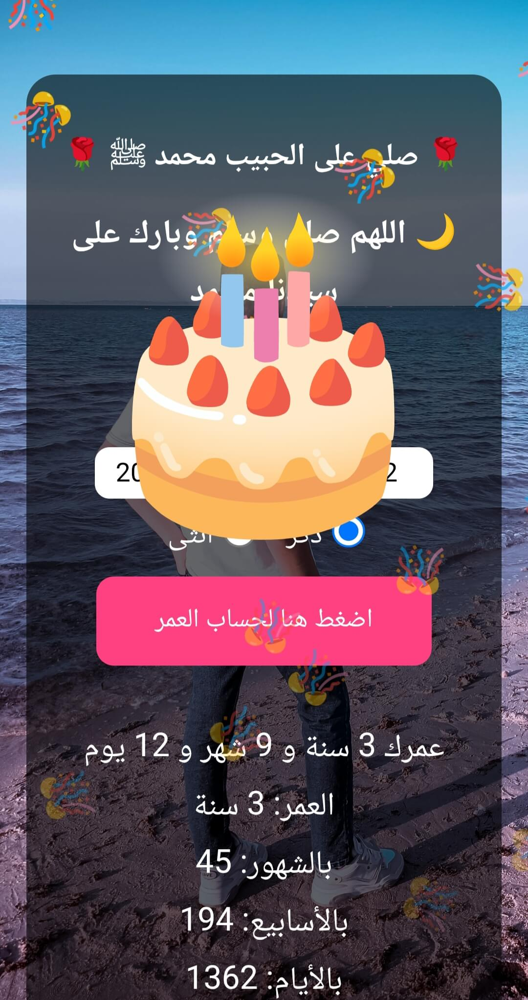
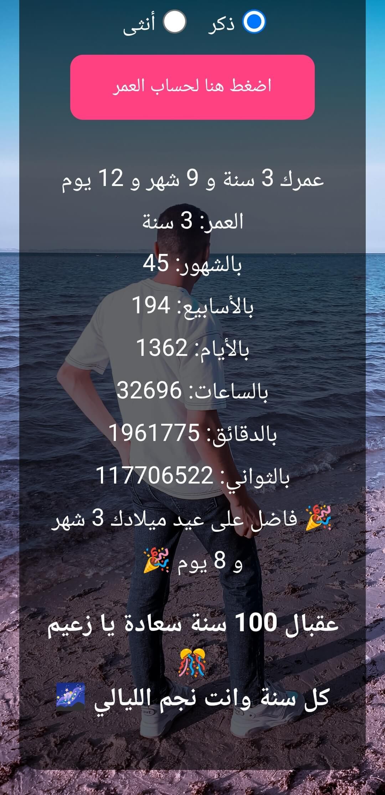
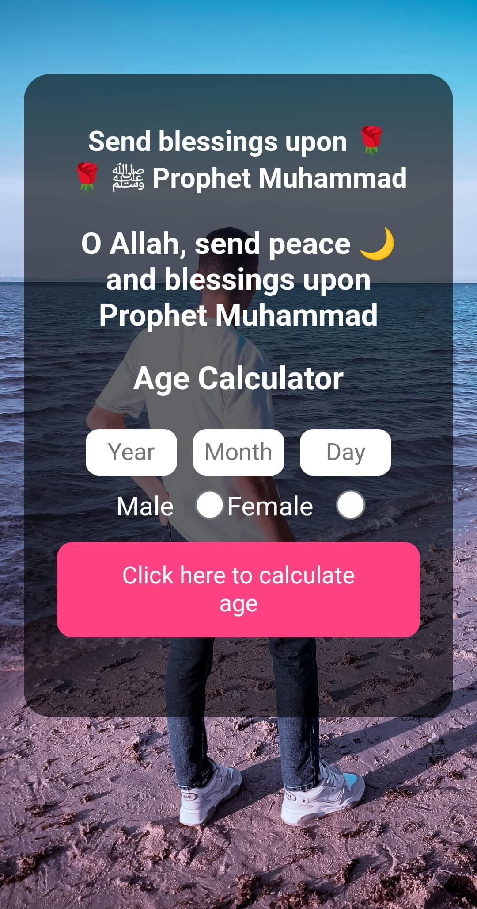
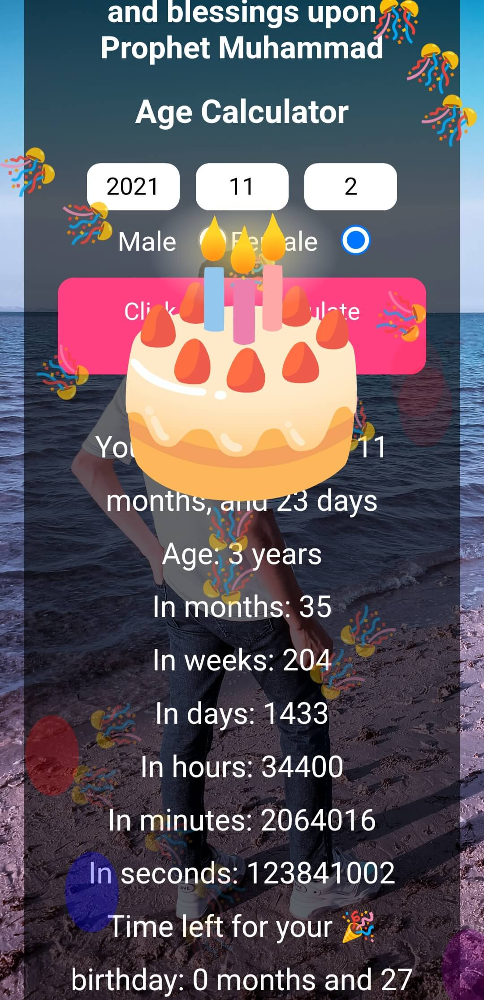
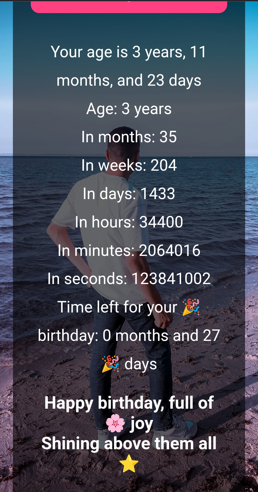

🎂 Age Calculator — More Than Just Numbers

Age Calculator is not just a simple tool — it’s a beautiful interactive experience that combines accuracy, elegance, and a touch of celebration. ✨

With just a few clicks, you can enter your date of birth and select your gender, and the website instantly calculates your exact age in years, months, weeks, days, hours, minutes, and even seconds ⏱️.

But that’s not all — it also tells you how much time is left until your next birthday, so you can look forward to your special day 🎉.

To make it even more personal, the website displays custom greetings based on gender, chosen randomly each time you use it —
so every visit feels unique and full of positive vibes 💫.

The interface is clean and modern, featuring a transparent box overlaying a vibrant background, with floating balloons, confetti, and an animated cake 🎂 that give you a mini birthday celebration right on your screen.

It’s also bilingual (Arabic & English) 🌍 and fully responsive, designed carefully to look great on mobile screens as well as desktop devices.

In short,
🔹 Age Calculator is more than a website —
it’s a joyful visual experience that lets you see your life in numbers, and celebrate it every single time you visit. ❤️
---
📸 project photos 

